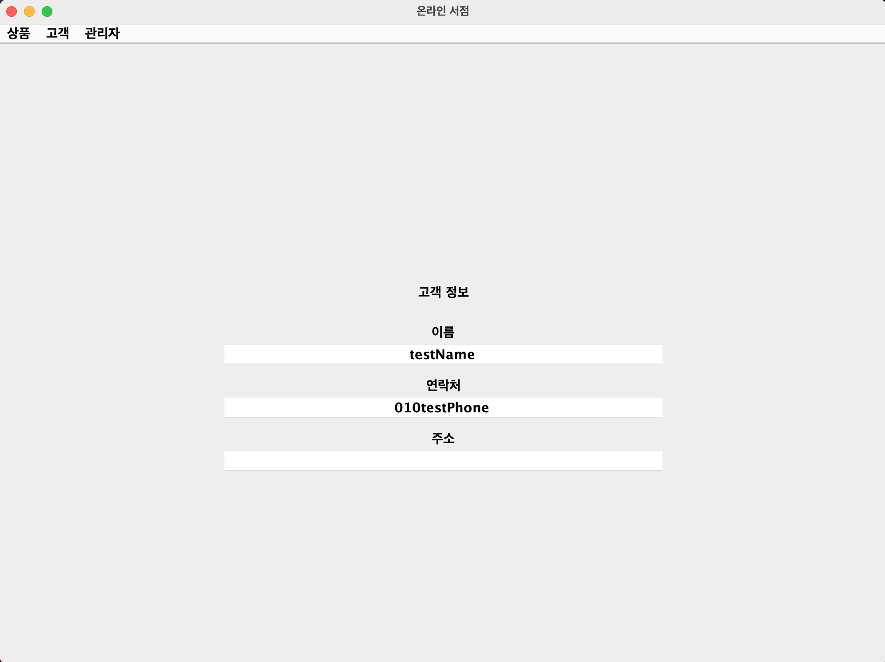
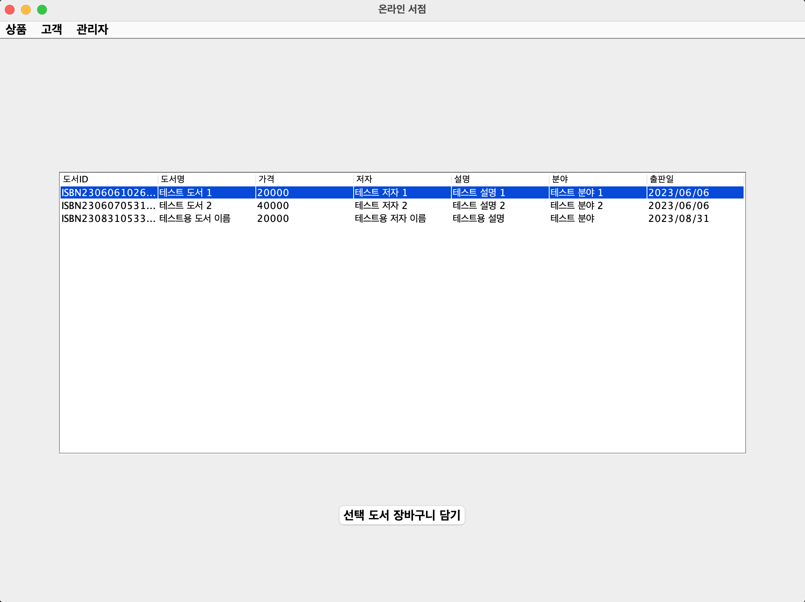
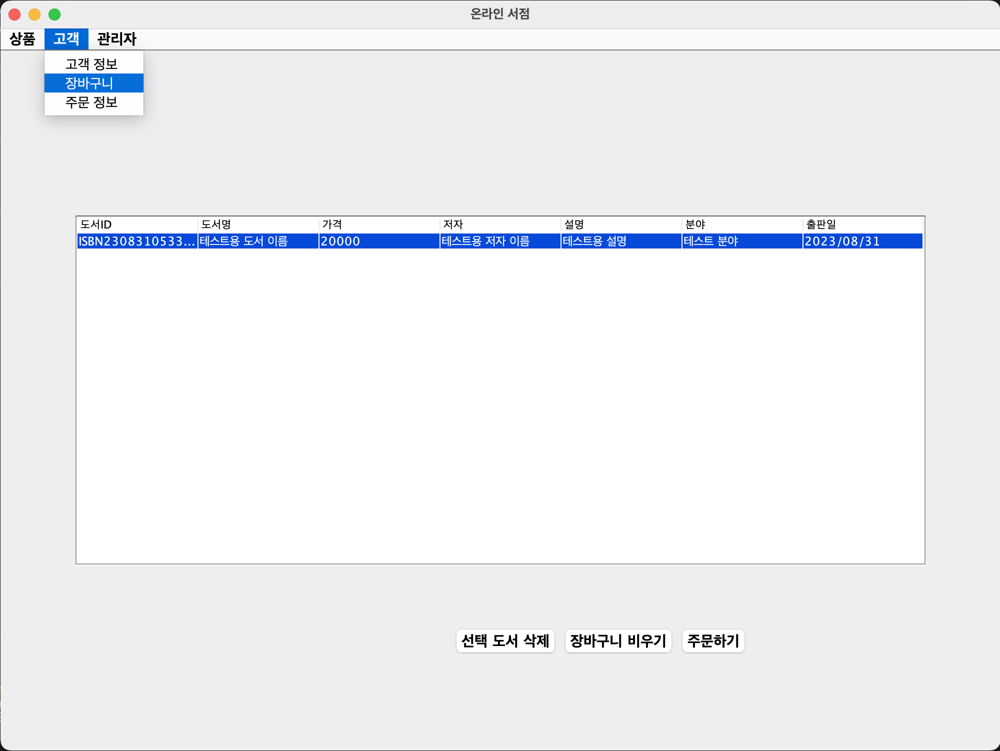
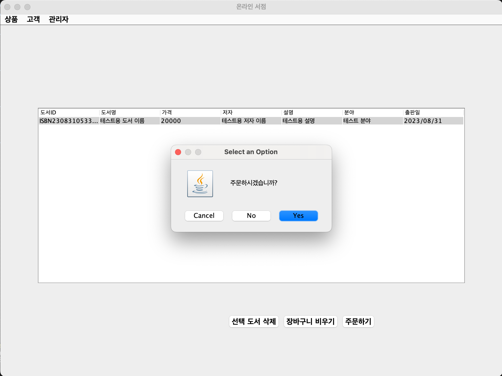
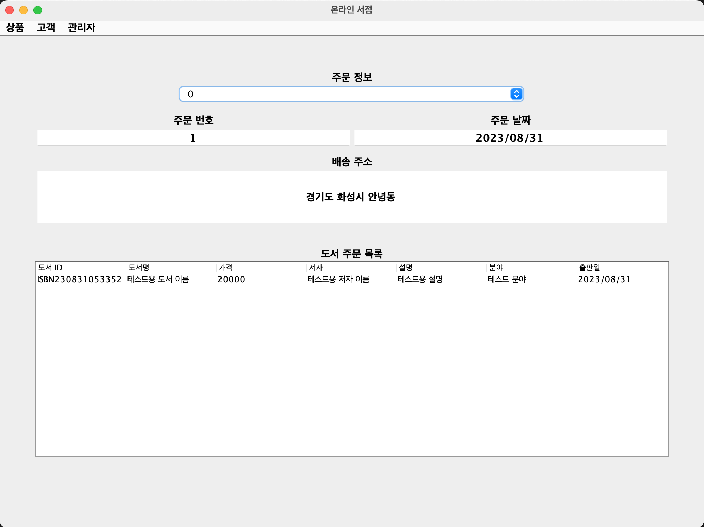
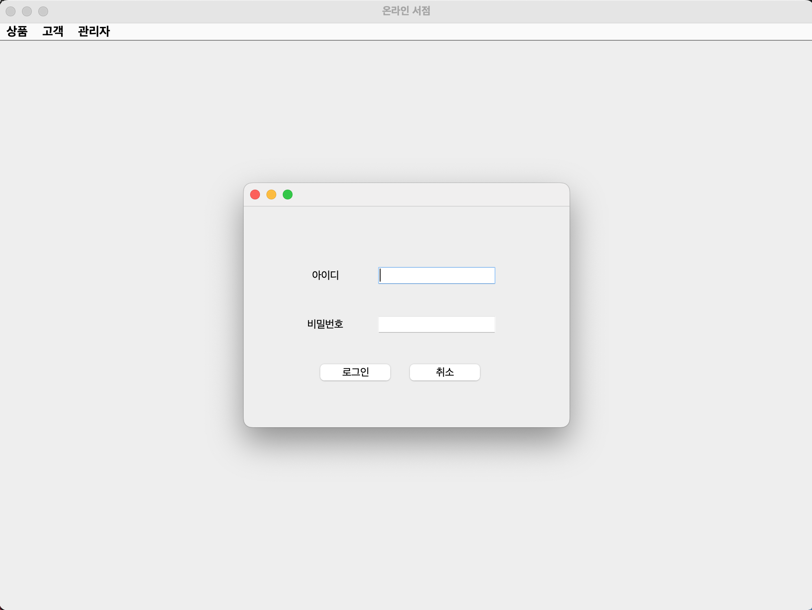
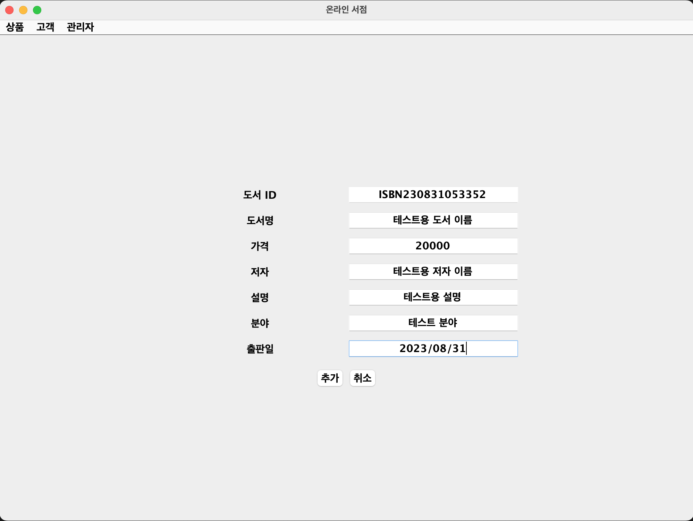

# Java 도서 쇼핑 GUI 프로그램

이 프로젝트는 “IT CookBook, JAVA 마스터” 도서를 참고하여 시작하였습니다.
자바의 문법과 객체 지향 설계를 활용한 도서 쇼핑 프로그램입니다.
GUI 프로그래밍 라이브러리인 Swing을 활용하여 UI를 제작하였습니다.

### 실행 방법

1. 이 프로젝트를 클론합니다.

```console
git clone https://github.com/namsu-k/BookMarketGUI.git
```

2. JDK가 설치되어 있지 않다면 JDK 17버전을 설치합니다.
3. 이클립스 또는 Java 소스를 실행할 수 있는 IDE를 활용하여 프로젝트를 엽니다.
4. 프로젝트 폴더에서 'Main.java' 파일을 열고 실행합니다.

### 주요 기능

- 고객 정보 조회
- 도서 목록 조회
- 장바구니에 도서 추가 및 삭제
- 주문하기 및 주문 정보 조회
- 관리자 로그인
- 새 도서 상품 추가

### 스크린샷

- 고객 정보 조회
  

- 도서 목록 조회
  

- 장바구니에 도서 추가 및 삭제
  

- 주문하기 및 주문 정보 조회
  
  

- 관리자 로그인 및 새 도서 상품 추가
  
  
